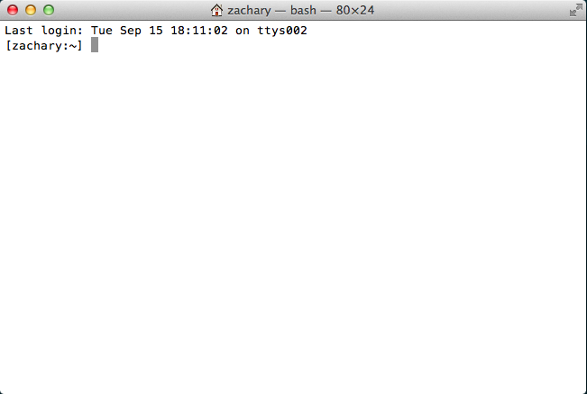
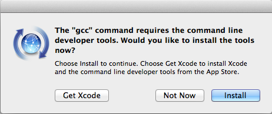
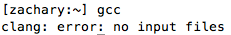

# Installing Xcode Command Line Tools

Installing the Xcode Command Line Tools will enable you to use programs
made for programming, such as the git version control system, the gcc
compiler, and many more tools. It's fairly straightforward, and should not
take long at all.

First, open the Terminal application. This program is located in
`Applications/Utilities/Terminal.app`. You can also search for it with
spotlight.

Once you open it, it should look a bit like this:



Type in `gcc` and press enter.

A window should pop up:



Click install and wait while the tools are installed. Once it is done
type the same command again (`gcc` and then enter). If you see



then everything was installed correctly.

# Installing Homebrew

[Homebrew](http://brew.sh/) (or Brew for short) is a package manager for OS X. 
It lets you easily install software that Apple does not provide by default.

To install it, make sure you have Terminal open. Then paste in:

```
ruby -e "$(curl -fsSL https://raw.githubusercontent.com/Homebrew/install/master/install)"
```

And press enter. It should let you know what it is doing as it installs. You may also have
to enter your password.

**When you enter your password, you will not be able to see the characters being typed and
your cursor won't move. This is for security reasons. Don't worry, you are still typing in the password.**

Once it's done, you can test it by installing a program called `wget`.

Type
```
brew install wget
```
and press enter.
